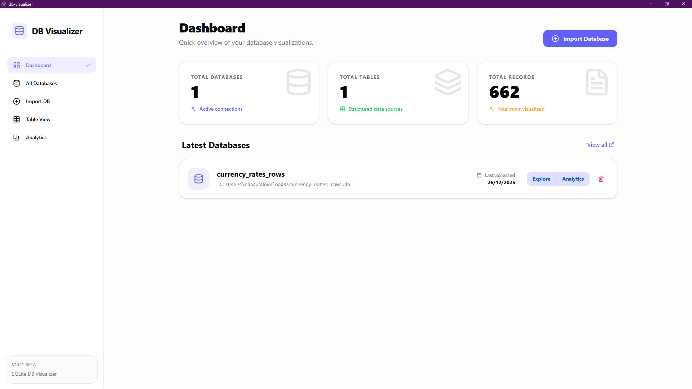
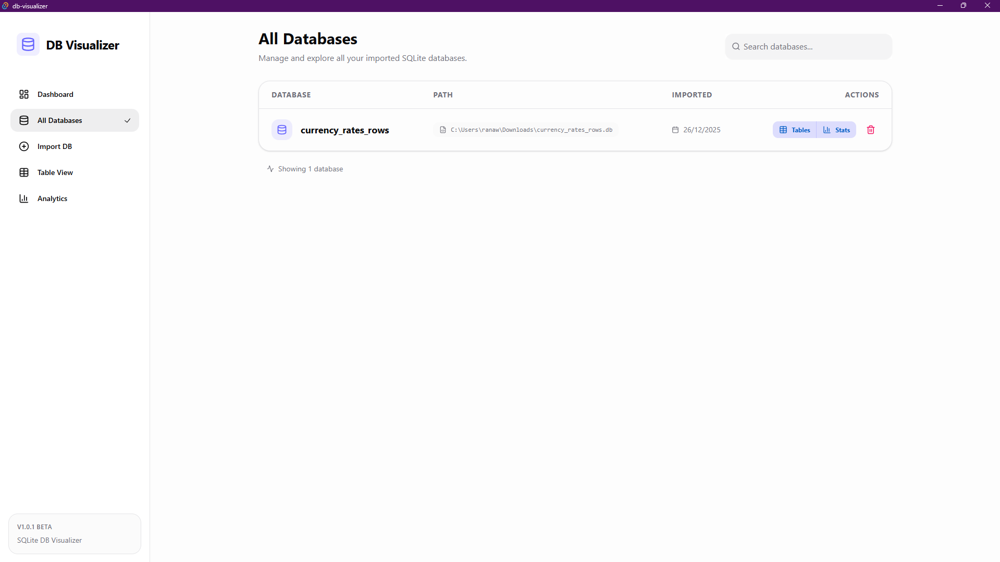
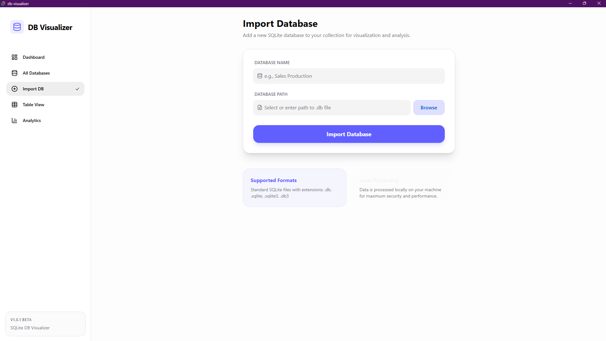
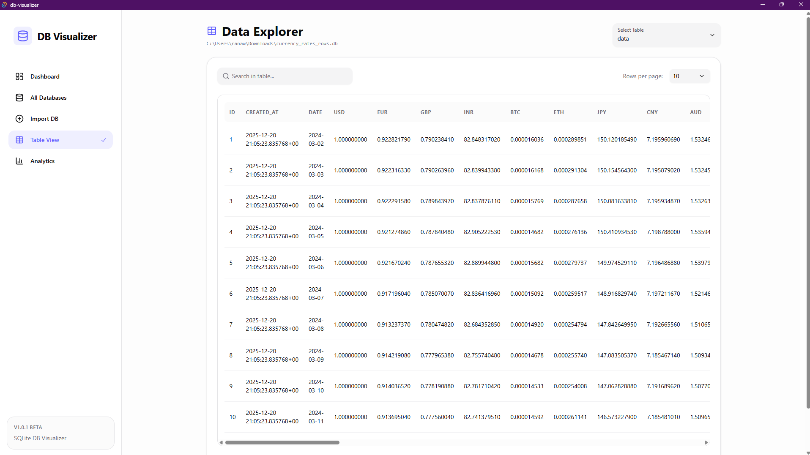

# DB Visualizer

<p align="center">
  
</p>

DB Visualizer is a powerful, modern, and lightweight application designed for effortless SQLite database exploration and analysis. Built with **Tauri**, **React**, and **HeroUI**, it provides a high-performance experience with a sleek, premium interface.

## ✨ Features

- 📂 **Database Management**: Easily import, track, and manage multiple SQLite databases.
- 📊 **Deep Analysis**: Automatic analysis of database content including:
  - Character frequency distribution.
  - Data type distribution (numeric, alphabetic, special).
  - Format detection (Emails, URLs).
- 🔍 **Interactive Table View**: Browse table data with high-speed pagination and real-time search.
- 📈 **Visual Statistics**: View file size, record counts, and table distribution at a glance.
- ⚡ **Background Processing**: Heavy analysis tasks run in the background without freezing the UI.

## 📸 Screenshots

<p align="left">
 <b>Dashboard</b>: Quick access to recent databases and high-level platform statistics.
    <p align="center">
  
  <br />
 </p>
 <b>All Databases</b>: Manage your library of SQLite files with detailed metadata and access tracking.
    <p align="center">
  
  <br />
 </p>
 <b>Import Database</b>: Simple drag-and-drop or file selection interface for importing new databases.
    <p align="center">
  
  <br />
 </p>
 <b>Table View</b>: High-performance data exploration with pagination and instant search.
    <p align="center">
  
  <br />
 </p>
 <b>Analytics</b>: Deep visual insights into character frequencies and automatic data type detection.
    <p align="center">
  
</p>

## 🛠️ Tech Stack

- **Frontend**: [React 19](https://react.dev/), [Vite](https://vitejs.dev/)
- **UI Framework**: [HeroUI](https://heroui.com/), [Tailwind CSS 4](https://tailwindcss.com/)
- **Backend**: [Tauri 2](https://tauri.app/) (Rust)
- **Database**: [SQLite](https://sqlite.org/) (via [rusqlite](https://github.com/rusqlite/rusqlite))
- **Icons**: [Lucide React](https://lucide.dev/)
- **Charts**: [Recharts](https://recharts.org/)

## 🚀 Getting Started

### Prerequisites

- [Node.js](https://nodejs.org/) (Latest LTS)
- [Rust](https://www.rust-lang.org/tools/install)
- [Tauri Dependencies](https://tauri.app/v1/guides/getting-started/prerequisites)

### Installation

1. Clone the repository:
   ```bash
   git clone https://github.com/yourusername/db-visualizer.git
   cd db-visualizer
   ```

2. Install dependencies:
   ```bash
   npm install
   ```

### Development

Run the application in development mode:
```bash
npm run tauri dev
```

### Build

Build the production-ready application:
```bash
npm run tauri build
```

## 🏗️ Architecture

- `src-tauri/`: Rust backend handling file system access and heavy SQLite operations.
- `src/`: React frontend with a modular component structure.
- `src-tauri/src/lib.rs`: Core Tauri commands and state management.
- `src-tauri/src/version.rs`: Versioning logic exposed to the frontend.

## 📄 License

This project is licensed under the MIT License - see the [LICENSE](LICENSE) file for details.
